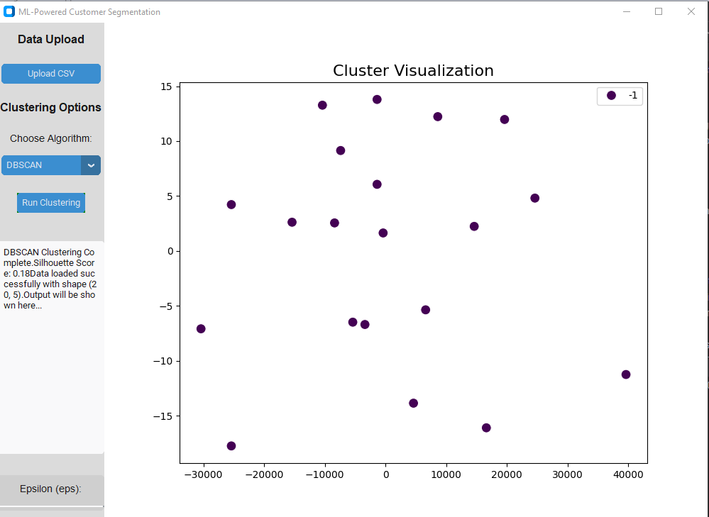
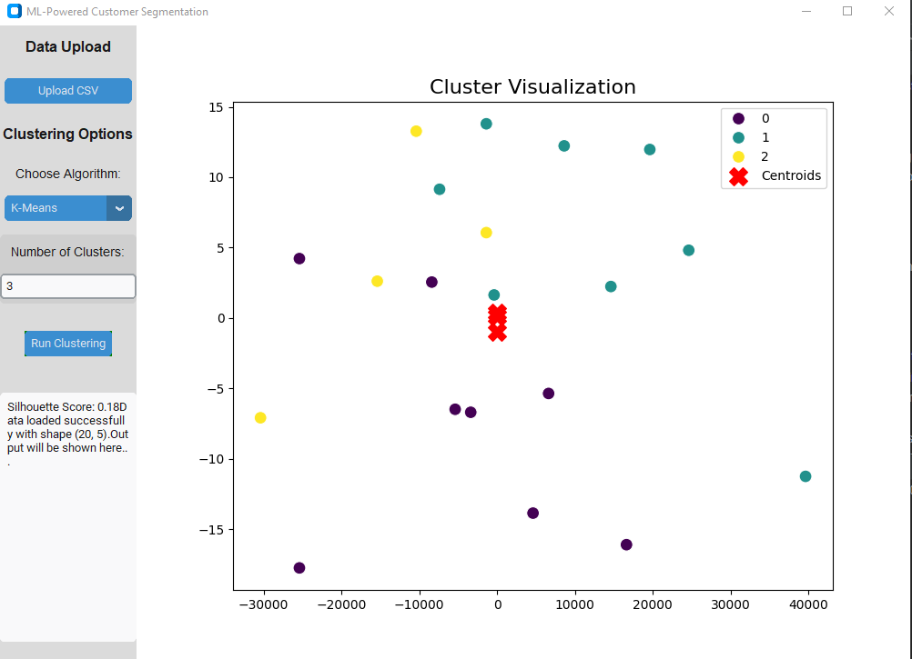
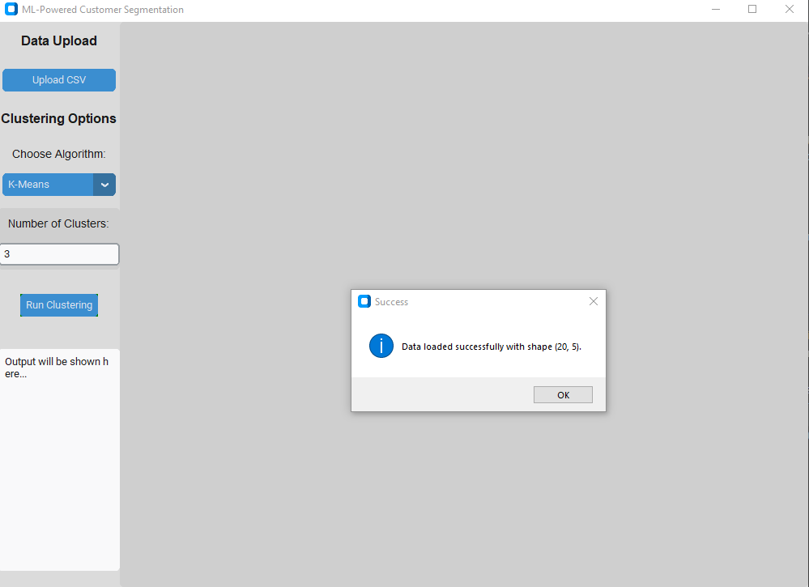
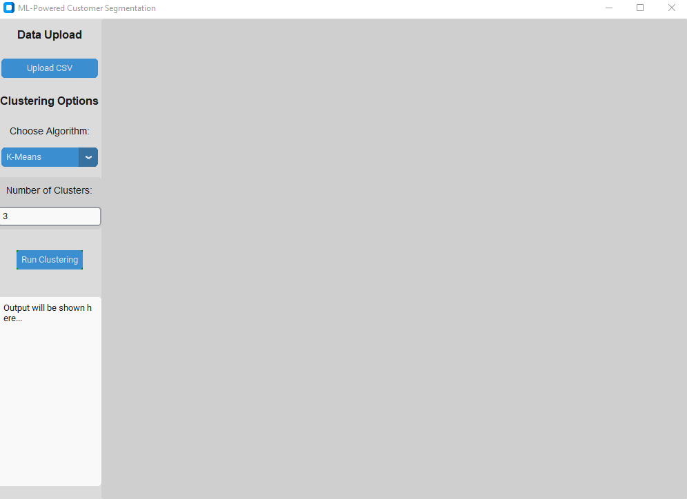

# ML-Powered Customer Segmentation App

This is a simple machine learning application built using `CustomTkinter` (CTk), designed to provide a user-friendly interface for customer segmentation through clustering techniques. The application allows users to upload datasets, choose between clustering algorithms, run the algorithms, visualize the results, and export the outcomes. It supports the following algorithms:
- K-Means
- DBSCAN

Additionally, it provides options for performing dimensionality reduction (PCA) for better visualization, and includes other advanced features like t-SNE visualization and cluster insights generation.

## Features

- **Data Upload**: Allows the user to upload a CSV file.
- **Clustering Options**: Supports K-Means, DBSCAN, and Hierarchical clustering.
- **Clustering Execution**: Run the clustering algorithm with user-defined parameters and display results.
- **Cluster Visualization**: Visualize the clusters using PCA and t-SNE for dimensionality reduction.
- **Export Results**: Export the processed data and clustering results as CSV files.
- **Cluster Insights**: Display cluster-wise insights like average values of features in each cluster.
- **Preprocessing**: Handle missing values and remove outliers intelligently before clustering.

## Requirements

To run this application, you need the following libraries:

- `CustomTkinter` - For the modern and customizable GUI components.
- `pandas` - For data manipulation and handling CSV files.
- `scikit-learn` - For machine learning algorithms (KMeans, DBSCAN, PCA, etc.).
- `matplotlib` - For visualizing clusters and charts.
- `seaborn` - For better visual aesthetics.
- `numpy` - For numerical computations.
- `opencensus` - For intelligent data preprocessing.

### Install the required packages:
To install the necessary Python packages, run:

```bash
pip install customtkinter pandas scikit-learn matplotlib seaborn numpy opencensus
```

### How to Run
1. Step 1: Clone the repository or download the script.
```bash
git clone https://github.com/kayung-developer/ML-Powered-Customer-Segmentation.git
```
2. Step 2: Ensure you have the required libraries installed.
- Run the command above to install dependencies.

3. Step 3: Run the application.
- Execute the Python script to start the application:
```bash
python app.py
```
- The application will launch with a user interface allowing you to upload a dataset and interact with various clustering features.

### Usage
1. Upload Dataset:
- Click the Upload CSV button to load your dataset into the application.
2. Choose Clustering Algorithm:
- Select the clustering algorithm of your choice from the Clustering Options panel:
- K-Means: Choose the number of clusters.
- DBSCAN: Set the epsilon value and minimum samples for clustering.
3. Run Clustering:
- Click Run Clustering to apply the selected algorithm to the dataset. The results, including a silhouette score for K-Means, will be displayed.
- For DBSCAN, it will display the clustering results directly.
4. Visualize Clusters:
- The clusters will be visualized using PCA (Principal Component Analysis) for dimensionality reduction, making it easier to view the clustering results.
5. Export Results:
- Once clustering is complete, click the Export Results button to save the results as a CSV file.
6. Additional Features:
- Preprocessing: Automatically clean the data by filling missing values and handling outliers before clustering.
- t-SNE Visualization: For more advanced dimensionality reduction, view the clusters using t-SNE.
- Cluster Insights: Get textual insights about the clusters, such as average values for each feature in the cluster.
### Screenshots

- An example of the ML-Powered Customer Segmentation App UI displaying the clustering results.

- 
- 
- 
### How It Works
- Data Preprocessing: The app first preprocesses the data by filling missing values with the column mean and removing outliers based on Z-scores.
- Clustering: Based on the selected algorithm (K-Means or DBSCAN), the app performs clustering and assigns labels to each data point.
- Dimensionality Reduction: The data is reduced to two dimensions using PCA for easier visualization.
- Visualization: The clusters are visualized on a 2D plot using Seaborn's scatter plot, with different colors representing each cluster.
- Exporting Results: Users can save the clustered data and insights in CSV format.

### Future Improvements
- Hierarchical Clustering: Support for hierarchical clustering algorithms (e.g., Agglomerative Clustering).
- Enhanced Insights: More advanced text-based insights, including feature importance.
- Interactive Visualizations: Adding interactivity to the plots (e.g., zooming or hovering over points to view details).


### License
This project is licensed under the MIT License - see the LICENSE file for details.

### Acknowledgements
- The application uses the following libraries:
CustomTkinter for modern GUI components.
scikit-learn for machine learning and clustering algorithms.
matplotlib and seaborn for visualizations.
pandas for data manipulation.
numpy for numerical computations.

### Contact
For any issues or suggestions, feel free to open an issue on GitHub or contact me at:

Email: princelillwitty@gmail.com


### Key Sections in the README:
- **Project Overview**: Describes the application and its features.
- **Requirements**: Lists the necessary Python libraries.
- **How to Run**: Step-by-step instructions for setting up and running the app.
- **Usage**: Explains the different functionalities of the app.
- **Screenshots**: A placeholder for a screenshot of the app interface.
- **How It Works**: Details the processes the app uses to load, preprocess, and cluster the data.
- **Future Improvements**: A section for potential enhancements.
- **License**: Information about the licensing of the code.

This README provides comprehensive information for users to understand and use the application effectively.
